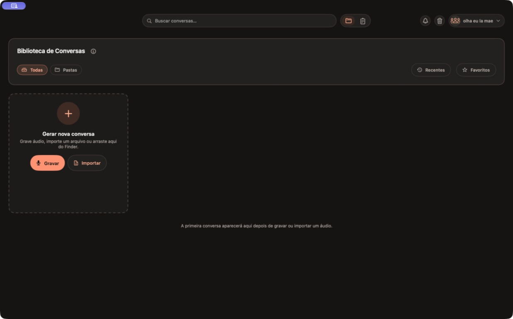
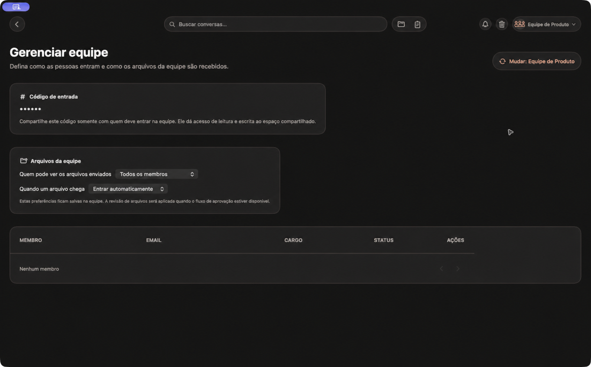

# Ōmu

> Reuniões gravadas, transcritas e transformadas em contexto acionável — com
> processamento local e espaços de equipe no iCloud.

[](https://github.com/Lucaddias/Papagaio/actions/workflows/ci.yml)
[](#requisitos)
[](https://www.swift.org/)
[](#licença)

O Ōmu é um aplicativo macOS para capturar ou importar áudios de reuniões,
organizar a biblioteca resultante e gerar transcrições, resumos, notas e tarefas.
O fluxo individual permanece no dispositivo; equipes usam um espaço CloudKit
compartilhado para sincronizar os dados textuais das conversas.

## Visão do produto

| O que resolve | Como aparece no app |
| --- | --- |
| Centralizar reuniões | Biblioteca com gravação, importação, busca, favoritos, pastas e lixeira. |
| Reduzir trabalho manual | Transcrição com timestamps, resumo, notas e tarefas vinculadas à conversa. |
| Preservar o contexto | Player com navegação pelos trechos da transcrição e anexos por conversa. |
| Trabalhar em grupo | Equipes com código de seis caracteres, convites do iCloud e espaço separado do perfil pessoal. |

## Capturas da build atual

<p align="center">
  
  
</p>

As capturas acima foram feitas na build local de 26 de agosto de 2026. Os dados
de perfil e equipe exibidos são de desenvolvimento.

## Recursos

- Gravação de microfone e áudio do sistema, com importação de arquivos de áudio.
- Transcrição local com Whisper, segmentação, timestamps e diarização.
- Resumo local com Qwen, incluindo temas, citações e próximos passos.
- Biblioteca pesquisável, favoritos, pastas, tarefas, anexos e lixeira com restauração.
- Perfil com Sign in with Apple e preferências visuais.
- Equipes CloudKit: criação de workspace, convite via `CKShare`, aceite de convite e entrada por código de seis caracteres.
- Sincronização de conversas textuais em espaços de equipe. Áudio e anexos continuam locais nesta etapa.

## Arquitetura

```text
Papagaio/                 Interface SwiftUI, recursos de produto e CloudKit
PapagaioCore/             Captura, persistência, transcrição, VAD e sumarização
PapagaioTests/            Testes do app e dos fluxos de persistência/equipes
Scripts/                  Bootstrap de runtimes e execução reproduzível de testes
ci_scripts/               Preparação do Xcode Cloud
docs/                     Capturas, histórico e documentação complementar
```

O app usa SwiftUI e Swift Concurrency. A biblioteca individual é persistida com
SwiftData; cada equipe recebe uma custom zone CloudKit compartilhada por
`CKShare`. O processamento de áudio e IA é executado no Mac com `whisper.cpp`,
`llama.cpp`, ONNX Runtime/Silero VAD e FluidAudio.

`Loro.xcodeproj`, o scheme `Loro` e os diretórios `Papagaio*` são nomes
técnicos mantidos por compatibilidade; o produto — o nome exibido no app e na
App Store — é Ōmu.

## Requisitos

- macOS 26 ou posterior, em Apple Silicon.
- Xcode compatível com o SDK do macOS 26 e Swift 6.
- Espaço em disco e memória suficientes para os runtimes e modelos locais.
- Conta iCloud ativa no Mac para criar, aceitar ou usar equipes.

Os frameworks de runtime não ficam versionados no Git. Isso reduz o tamanho do
repositório e mantém o clone reproduzível: o bootstrap baixa versões fixadas e
verifica o SHA-256 de cada artefato.

## Começar a desenvolver

```bash
git clone https://github.com/Lucaddias/Papagaio.git
cd Papagaio
./Scripts/bootstrap-runtimes.sh
open Loro.xcodeproj
```

No Xcode, selecione o scheme `Loro` e execute no seu Mac. Para usar equipes,
habilite o container `iCloud.com.papagaio.Papagaio` na assinatura do target e
publique o schema correspondente no CloudKit Dashboard. O registro público
`CodigoDeEquipe` precisa disponibilizar os campos `codigoDeEntrada` (consultável)
e `urlDoCompartilhamento`. A exclusão global de equipes também requer o tipo
público `EquipeExcluida`, com `equipeID` (String), `excluidaEm` (Date) e
`estadoDaExclusao` (String). Esse
marcador permite que instalações de participantes removam a cópia local ao se
conectarem novamente depois que a zona compartilhada foi apagada.

No tipo `Equipe` da zona compartilhada, publique também o campo `nomesDosParticipantes`
como `Bytes`. Ele guarda o mapa de nomes exibidos pela equipe; cada participante
altera somente o próprio nome, enquanto o proprietário pode corrigir qualquer um.

## Validar localmente

```bash
./Scripts/bootstrap-runtimes.sh
./Scripts/testa-papagaio-core.sh

xcodebuild build \
  -project Loro.xcodeproj \
  -scheme Loro \
  -destination 'generic/platform=macOS' \
  -skipPackagePluginValidation \
  CODE_SIGNING_ALLOWED=NO
```

O GitHub Actions configura o bootstrap, os testes do `PapagaioCore`, os testes
do app com `PAPAGAIO_TEST_MODE=1` e o build para pull requests direcionados a
`main`. No modo de teste, o lançamento usa um host vazio; os testes continuam
responsáveis por injetar armazenamento temporário e serviços falsos.

## Plano e revisões

- [Plano de aplicação de produto](PLANO-APLICACAO-INTELIGENCIA-PRODUTO-PAPAGAIO.md): classificação, prioridades e critérios de aceite.
- [Revisão de bugs e fluxos de dados](docs/REVISAO-PLANO-E-FLUXOS-2026-08-28.md): mapa de entradas/saídas, correções, evidências e validações pendentes.

## Limites conhecidos

- A sincronização de equipes cobre os dados textuais das conversas; mídias e
  anexos não são enviados ao CloudKit nesta versão.
- O fluxo de criação, convite, aceite e sincronização deve ser validado com
  duas contas iCloud reais antes de uma distribuição pública.
- Um arquivo em `docs/historico/` registra uma decisão anterior de remover
  CloudKit. Ele foi preservado por rastreabilidade e não descreve a versão atual.

## Contribuição

1. Crie uma branch a partir de `main`.
2. Faça uma alteração pequena e verificável.
3. Rode os comandos de validação relevantes.
4. Abra um pull request explicando comportamento, testes e limites da mudança.

Evite versionar `PapagaioCore/Frameworks/`, modelos baixados, `.build/`, dados
derivados do Xcode e `.DS_Store`; eles já estão cobertos pelo `.gitignore`.

## Licença

Ainda não há uma licença de código aberto definida para este repositório. Até
uma licença ser adicionada, não assuma permissão para redistribuir o código ou
os modelos incluídos no fluxo de desenvolvimento.
